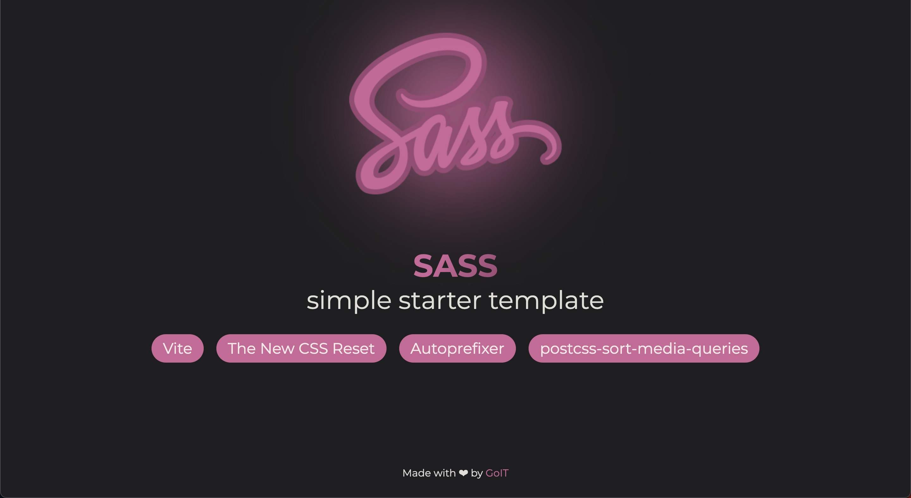

# Simple starter template for Sass

## Vanilla App Template

Цей проект було створено за допомогою Vite. Для знайомства та налаштування
додаткових можливостей [звернись до документації](https://vitejs.dev/).

Ключові особливості цього шаблону:

**Build Tools:** Vite.js
**Plugins:** Autoprefixer, PostCSS Sort Media Queries
**Styles:** SCSS
**Reset:** \_reset.scss (Based on The New Reset CSS)

